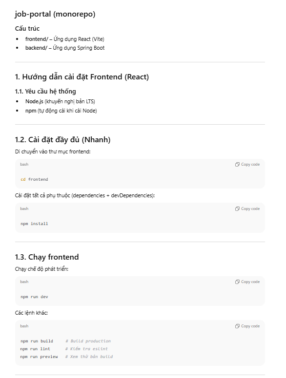
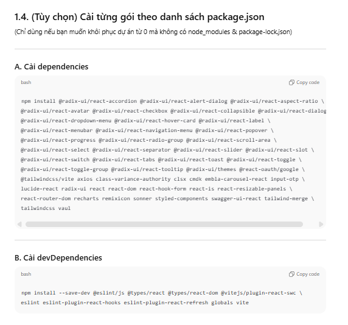
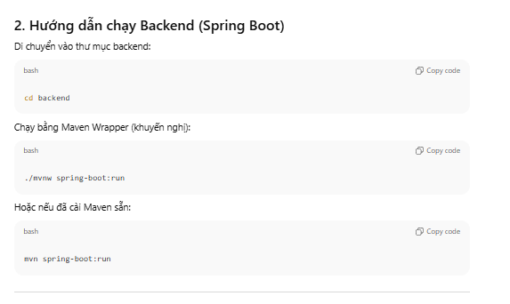
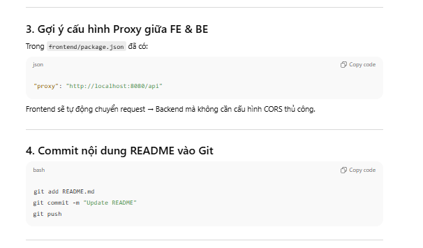

# job-portal (monorepo)

## Cấu trúc
- frontend/: Ứng dụng React (Vite)
- backend/: Ứng dụng Spring Boot

--------------------------------------------

# 1. Hướng dẫn cài đặt Frontend (React)

## Yêu cầu
- Node.js (bản LTS)
- npm đi kèm Node

## 1.1. Cài đặt nhanh
cd frontend
npm install

## 1.2. Chạy frontend
npm run dev

Các script khác:
- npm run build
- npm run lint
- npm run preview

--------------------------------------------

# 1.3. Cài từng gói theo package.json (tùy chọn)

## A. Dependencies
npm install @radix-ui/react-accordion
             @radix-ui/react-alert-dialog
             @radix-ui/react-aspect-ratio 
             @radix-ui/react-avatar 
             @radix-ui/react-checkbox 
             @radix-ui/react-collapsible 
             @radix-ui/react-dialog 
             @radix-ui/react-dropdown-menu 
             @radix-ui/react-hover-card 
             @radix-ui/react-label 
             @radix-ui/react-menubar 
             @radix-ui/react-navigation-menu 
             @radix-ui/react-popover 
             @radix-ui/react-progress 
             @radix-ui/react-radio-group 
             @radix-ui/react-scroll-area 
             @radix-ui/react-select 
             @radix-ui/react-separator 
             @radix-ui/react-slider 
             @radix-ui/react-slot
             @radix-ui/react-switch
             @radix-ui/react-tabs 
             @radix-ui/react-toast
             @radix-ui/react-toggle 
             @radix-ui/react-toggle-group 
             @radix-ui/react-tooltip @radix-ui/themes 
             @react-oauth/google
             @tailwindcss/vite 
             axios 
             class-variance-authority 
             clsx 
             cmdk 
             embla-carousel-react 
             input-otp 
             lucide-react 
             radix-ui 
             react 
             react-dom 
             react-hook-form 
             react-is 
             react-resizable-panels 
             react-router-dom 
             recharts 
             remixicon 
             sonner 
             styled-components 
             swagger-ui-react 
             tailwind-merge 
             tailwindcss 
             vaul

## B. DevDependencies
npm install --save-dev @eslint/js 
                       @types/react 
                       @types/react-dom 
                       @vitejs/plugin-react-swc 
                       eslint 
                       eslint-plugin-react-hooks 
                       eslint-plugin-react-refresh 
                       globals 
                       vite

--------------------------------------------

# 2. Chạy Backend (Spring Boot)

cd backend
./mvnw spring-boot:run
# hoặc:
mvn spring-boot:run

--------------------------------------------
# 3. Chạy FE 
- sử dụng lệnh npm run dev để chạy hệ thống sau khi cài đặt hết các gói cần thiết

--------------------------------------------
# 4. Commit README vào Git

git add README.md
git commit -m "Update README"
git push

--------------------------------------------
# 5. Phần hình ảnh

